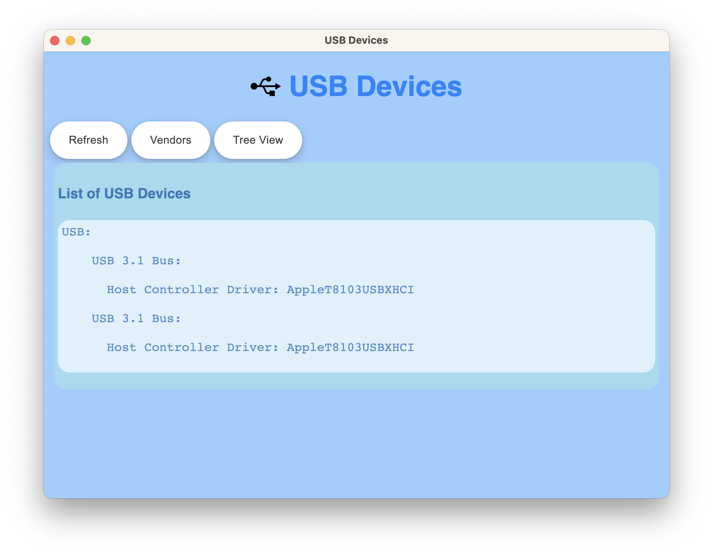

# LSUSB-UI

[](https://github.com/ellerbrock/open-source-badges/)
[](https://opensource.org/licenses/mit-license.php)

<br>
*Graphical User Interface for lsusb - ElectronJS.*
<br> 
<h2>Functionality :</h2> List the USB Devices attached to the macbook with their manufacturer and more information.

**Webpage:** [lsusb-ui](https://singh47.github.io/lsusb-ui/)
**Mac's DMG:** [Download here](https://drive.google.com/file/d/18FWyW3jl-t0XWtuNrTAGaEdgARvg3d27/view?usp=sharing)

## How to start
Either, just [download the DMG file](https://drive.google.com/file/d/18FWyW3jl-t0XWtuNrTAGaEdgARvg3d27/view?usp=sharing).
<br>
1. Clone or download the project using link: https://github.com/singh47/lsusb-ui.git
2. Run following command to install node modules
<br>```yarn```
2. Run following in terminal
<br>```npm start```

## Build the application for your machine (windows, mac, linux): 
1. Clone or download the project using link: https://github.com/singh47/lsusb-ui.git
2. Run following command to install node modules
<br>```yarn```
2. Run following in terminal
<br>```npm run make```

## Showcase


## Dependencies (mac version)
- @electron-forge/cli@6.0.4
- @electron-forge/maker-deb@6.0.4
- @electron-forge/maker-rpm@6.0.4
- @electron-forge/maker-squirrel@6.0.4
- @electron-forge/maker-zip@6.0.4
- electron-root-path@1.1.0
- electron-squirrel-startup@1.0.0
- electron@22.0.3

**Members:**
1. [Jagroop Singh](https://github.com/r97draco)
2. [Harmandeep Singh](https://github.com/singh47)
